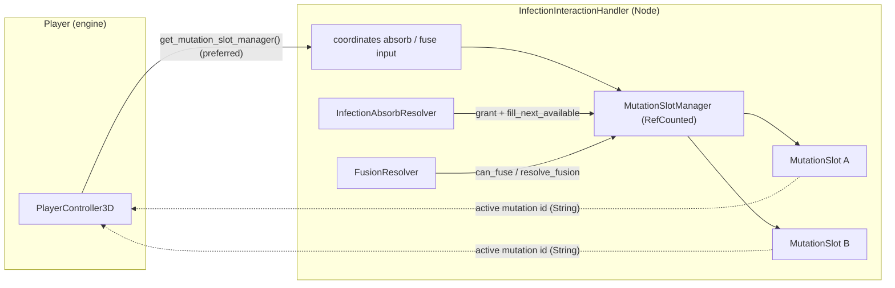

# Blobert Devlog #4: Designing the Mutation System (Part 1)

Mutation was always the point of Blobert. The chunk system and the infection loop all exists to support stealing traits and doing something interesting with them.

So this phase wasn’t about inventing the system. It was about forcing it into a shape that wouldn’t fall apart the moment I added a second mutation.

---

## From “hit enemy” to actual data

The first step was making mutations real.

Up until this point, “absorbing” an enemy was mostly visual. The chunk sticks, something happens, but there wasn’t a clean pipeline turning that into structured data the rest of the game could use.

So I introduced an explicit resolver layer: pure `RefCounted` logic, no scene tree inside it. Absorb checks the enemy state machine, transitions the enemy to dead, records a mutation ID in inventory, and fills a slot through a small dispatch so both the dual-slot manager and a legacy single `MutationSlot` still work.

Enemy state → IDs the rest of the game can query:

```gdscript
const DEFAULT_MUTATION_ID: String = "infection_mutation_01"

func resolve_absorb(esm: EnemyStateMachine, inv: Object, slot: Object = null, mutation_id: String = "") -> void:
	if esm == null or inv == null or not can_absorb(esm):
		return
	var mid: String = mutation_id if mutation_id != "" else DEFAULT_MUTATION_ID
	esm.apply_death_event()
	inv.grant(mid)
	if slot != null:
		if slot.has_method("fill_next_available"):
			slot.fill_next_available(mid)
		elif slot.has_method("set_active_mutation_id"):
			slot.set_active_mutation_id(mid)
```

There is no `Mutation` class or factory in this path yet; mutations are string IDs (`"infection_mutation_01"`, per-enemy `mutation_drop`, etc.). The enemy doesn’t reach into the player; the resolver hands an ID to inventory and to whatever slot object you passed in.

---


---

## Inventory before slots (on purpose)

Before locking into slots, I needed a place for granted mutations to exist at all. That’s where `MutationInventory` came in.

Not because I wanted a full inventory system, but because I needed a buffer between “this absorb happened” and “the HUD / future systems need to know what you’ve ever been granted.”

Simple intake: append the ID, headless-testable:

```gdscript
var _granted_ids: Array[String] = []

func grant(id: String) -> void:
	_granted_ids.append(id)
```

This stage is intentionally boring. No branching gameplay rules, just proof that grant history can live outside the player controller and the UI.

It also gave the agent fewer sharp objects to juggle while the slot story was still moving.

---

## Slots make it a system

The real shift happens when active loadout stops being “whatever we appended last” and becomes a small, fixed surface: two slots, explicit fill rules, one coordinator.

I don’t want infinite stacking. I want tradeoffs.

So equipped mutations live in a `MutationSlotManager` (`RefCounted`): it owns two `MutationSlot` instances (each holds a single `String` active ID). Fill order is A first, then B; if both are full, B gets overwritten (last absorb wins on the second slot). There is no `get_all()`; callers use `get_slot_count()`, `get_slot(i)`, and `any_filled()` when they only need a boolean.

Core shape: this is the real coordinator (two `MutationSlot` refs, first-available fill, last absorb wins on B when both full):

```gdscript
class_name MutationSlotManager
extends RefCounted

const _MutationSlotScript: GDScript = preload("res://scripts/mutation/mutation_slot.gd")
var _slots: Array = []

func _init() -> void:
	_slots = [_MutationSlotScript.new(), _MutationSlotScript.new()]

func get_slot(index: int) -> RefCounted:
	if index < 0 or index >= _slots.size():
		return null
	return _slots[index]

func fill_next_available(id: String) -> void:
	if id == "":
		push_error("MutationSlotManager.fill_next_available: id must not be empty")
		return
	if not _slots[0].is_filled():
		_slots[0].set_active_mutation_id(id)
	elif not _slots[1].is_filled():
		_slots[1].set_active_mutation_id(id)
	else:
		_slots[1].set_active_mutation_id(id)

func consume_fusion_slots() -> void:
	clear_all()
```

This is where the system actually locks in: UI and gameplay read the same manager the absorb and fusion paths write through, not parallel arrays of mystery objects.

---


---

## Wiring it into gameplay (where it usually breaks)

This is also where agents tend to go off the rails.

The correct implementation is: consumers read from the slot manager you get from `InfectionInteractionHandler` (the handler owns the manager; the player caches `get_mutation_slot_manager()` in `_ready`, with a fallback to `get_mutation_slot()` for slot A only).

The incorrect implementation (what keeps showing up) is: side channels, absorb logic poking player stats, UI holding its own copy of “what’s equipped,” anything that skips the manager because it’s expedient.

So a lot of this phase was forcing the wiring to stay clean.

Today movement is the honest example: it doesn’t iterate rich `Mutation` objects; it asks whether anything is equipped and applies one multiplier:

```gdscript
var speed_multiplier: float = 1.0
if _mutation_slot != null:
	var mutation_active: bool = false
	if _mutation_slot.has_method("any_filled"):
		mutation_active = _mutation_slot.any_filled()
	elif _mutation_slot.has_method("is_filled"):
		mutation_active = _mutation_slot.is_filled()
	if mutation_active:
		speed_multiplier = _MUTATION_SPEED_MULTIPLIER
_simulation.max_speed = _base_max_speed * speed_multiplier
```

When passives multiply, the same rule applies: walk `get_slot(i)`, read `get_active_mutation_id()` on each filled `MutationSlot`, map IDs to effects once in one place; not `recalculate_stats()` calling a fictional `get_all()` that doesn’t exist.

No direct references. No “just this one special case.” If it’s not coming through the slot manager, it’s wrong.

---



---

## Letting mutations interact (early fusion hook)

Once both slots are filled, interaction became possible, but fusion in Blobert today is not “breed two `Mutation` objects into a third.”

`FusionResolver` is still pure logic: `can_fuse` requires both slots filled; `resolve_fusion` applies a timed speed boost on the player (`apply_fusion_effect(duration, multiplier)`) and then calls `consume_fusion_slots()` on the manager, which clears both slots so you can re-infect. No return value with a new mutation type; the “something new” is the timed effect plus empty slots.

```gdscript
func resolve_fusion(slot_manager: Object, player: Object) -> void:
	if not can_fuse(slot_manager):
		return
	if player != null and player.has_method("apply_fusion_effect"):
		player.apply_fusion_effect(FUSION_DURATION, FUSION_MULTIPLIER)
	if slot_manager.has_method("consume_fusion_slots"):
		slot_manager.consume_fusion_slots()
```

That’s the first gameplay hook where two equipped IDs matter together. Richer fusion recipes can layer on later; the important part for the devlog is that slots are consumed through the manager, not ad-hoc globals.

---


---

## The part agents are bad at

None of this was particularly hard to design.

The hard part was getting the agent to respect the structure.

Left alone, it will duplicate mutation state, bypass the slot manager “just this once,” wire UI to stale mirrors, or invent APIs that sound tidy (`get_all()`, `Mutation` factories) that aren’t in the project. It passes tests, but the system drifts.

That’s why this phase has so many tests tied to it. Not just for correctness, but to lock the shape in place: dual-slot behavior, adversarial edge cases, fusion ordering (effect before consume), HUD paths that ask the same manager the player uses.

---

## What I learned

I didn’t learn how to build a mutation system from scratch.

I learned that if I want an agent to extend one without collapsing it, I need the data model spelled out (IDs not mystery objects, manager owns slots, handler owns manager), a single write path into those slots from resolvers, and enough tests that “shortest path” refactors can’t quietly delete `fill_next_available` dispatch or split slot state across two owners.

The agent will always take the shortest path. If I let it, that path is a rewrite or worse, a green CI build and a broken playtest.
