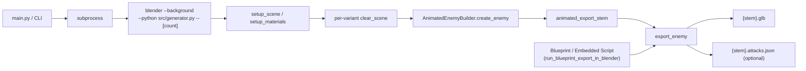
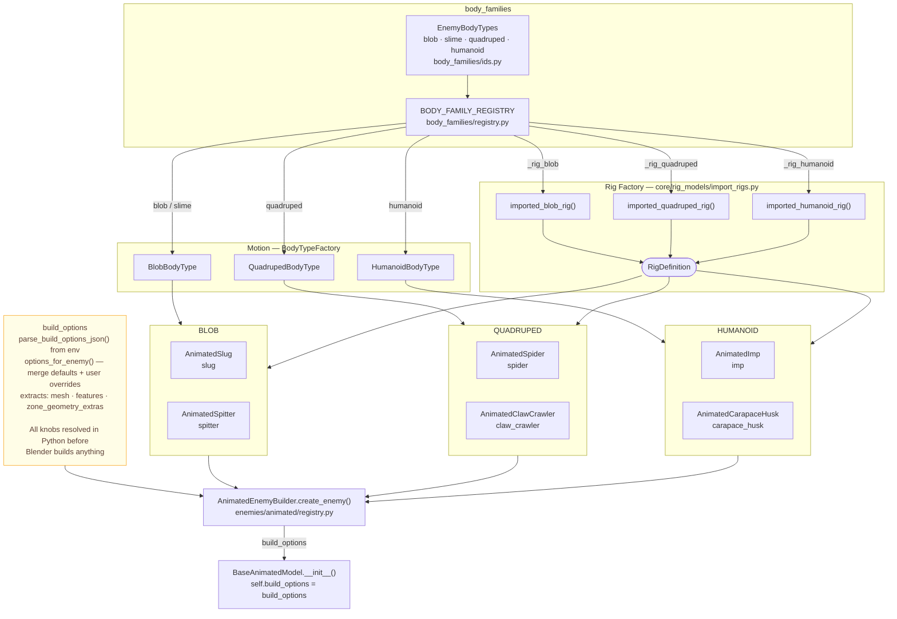

# Blobert Devlog #6: Generating Enemies: 3D Modeling Purely with Code

I am not a 3D artist. I am a software engineer who now knows just enough Blender internals to be dangerous. This is important context because nothing about this pipeline is the “correct” way to do it.

The correct approach here is simple: download some free assets and move on with your life. I did not do that. I decided I wanted full control over my enemies, which is a polite way of saying I chose pain.

---

## One pipeline, no forks, no excuses

> CLI → Blender subprocess → GLB factory with opinions

Blobert enemies are generated through a headless Blender pipeline driven by Python. A CLI entrypoint spawns Blender via subprocess, executes a controlled script, and produces:

- rigged GLB assets
- optional attack metadata JSON
- deterministic variant outputs

That sounds reasonable until I realized I accidentally built three different ways to run the same pipeline, each slightly incompatible, and then had to slowly delete two of them while pretending it was “intentional refactoring.”

I needed to harden my constraints. So I decided on:

- one registry of enemy slugs and classes
- one Blender execution pipeline
- one export function responsible for GLB + metadata

Everything else is allowed to be chaotic, but those three things are not allowed to lie.

---

## Hands out of Blender (or why I refuse to become a Blender wizard)

I am not trying to learn Blender deeply for this project. That is a trap. A beautiful, well-documented, time-eating trap.

Blender owns `bpy`. You only get it if you are running inside Blender. So the setup is:

- normal Python handles CLI, tests, orchestration
- Blender handles everything heavy through `blender --background --python ...`

Simple in theory. Slightly haunted in practice.

I built a single entry point so I can run something like:

`python main.py` or `./enemy.sh`

That script spins up Blender, passes a payload, and runs `src/generator.py`.

That file then:
- sets up the scene
- builds materials
- loops over variants
- calls the enemy builder

This exists because the alternative is either:
- everything lives inside Blender and testing becomes painful  
- or everything lives outside Blender and imports turn into a cursed dependency spiral

So I picked a third option: **a controlled split where both sides kind of behave if I stare at them hard enough**

I wish that this was just about elegance but its really about damage control.

Here is a diagram of the pipeline:



---

## The generator loop: Create, Nuke, Rinse, Repeat

`generator.py` is where things actually happen. It is argv-driven, but once it starts running, it becomes a loop with a lot of defensive habits.

First we set up scene and materials. Nothing interesting.

Then we loop variants.

And for each variant:
1. I delete everything.
2. Then I set it up again.

Yes, really.

`clear_scene()`, then `setup_scene()`.

At first this feels wrong. Then Blender reminds you that it is perfectly happy to keep state you forgot existed. Suddenly your “three variants” become three spiritually connected abominations sharing the same skeleton.

So now everything gets reset like I am mildly afraid of memory.

Each variant also gets its own RNG (Random Number Generator). No shared randomness. If I do not pass a seed, I generate one. I want deterministic when I care, chaos when I do not, and absolutely no cross-variant telepathy.

Prefabs exist too. Sometimes I want to start from an existing mesh and let the system do its thing on top of it. This turned out to be way more useful than expected because it lets me mix “hand made” and “generated chaos” without rewriting anything.

File naming gets slightly worse here but in a consistent way, which is the best kind of worse:

```text
~/workspace/blobert/asset_generation/python [[🐍 .venv]] (main ●) > ls ./animated_exports/
acid_spitter_animated_00.blend                   adhesion_bug_animated_01.blend.import            claw_crawler_animated_00.glb.import              imp_animated_00.blend1                           spider_animated_00.glb.import
acid_spitter_animated_00.blend.import            adhesion_bug_animated_01.glb
....
```

Finally, the configuration.
Instead of adding 47 CLI flags I will regret later, I pass a JSON blob through `--build-json`,  mirrored into `BLOBERT_BUILD_OPTIONS_JSON`, and merge it once inside Python.
There is exactly one merge point. Not two.
Not “just one more special case.”
One.

- defaults come from enemy definition
- overrides come from CLI or embedded scripts
- final config is resolved once before build

No downstream reinterpretation is allowed.

I only repeat myself beccuase it was a headache to get this right.

```text
> python main.py animated claw_crawler 1 --finish metallic --hex-color "#501796"
🎮 Generating Animated Enemy: claw_crawler
==========================================
✨ Finish: metallic
🎨 Custom HEX: #501796

🎬 Generating claw_crawler...
Blender 5.0.1 (hash a3db93c5b259 built 2025-12-16 01:51:40)
🎮 Generating 1 claw_crawler(s), finish=metallic, hex=#501796...
Generating claw_crawler #00...
✅ Auto weights successful: 9 vertex groups created
🔧 Fixing body part specific bindings...
✅ Body part bindings optimized
Created Idle animation: frames 1-48
Created Walk animation: frames 1-24
Created Attack animation: frames 1-36
Created Hit animation: frames 1-12
Created Death animation: frames 1-72
Created Spawn animation: frames 1-48
Created SpecialAttack animation: frames 1-60
Created DamageHeavy animation: frames 1-24
Created DamageFire animation: frames 1-18
Created DamageIce animation: frames 1-30
Created Stunned animation: frames 1-60
Created Celebrate animation: frames 1-36
Created Taunt animation: frames 1-24
NLA: 13 strips wired
✅ 13 self-contained animation actions created
Info: Saved as "claw_crawler_animated_00.blend"
Debug export: animated_exports/claw_crawler_animated_00.blend
INFO Draco mesh compression is available, use library at /Applications/Blender.app/Contents/Resources/5.0/scripts/addons_core/io_scene_gltf2/libextern_draco.dylib
10:10:07 | INFO: Starting glTF 2.0 export
10:10:07 | INFO: Extracting primitive: Sphere
10:10:07 | INFO: Primitives created: 3
10:10:07 | WARNING: There are more than 4 joint vertex influences.The 4 with highest weight will be used (and normalized).
10:10:07 | INFO: Finished glTF 2.0 export in 0.16885113716125488 s

Exported: animated_exports/claw_crawler_animated_00.glb
✅ Exported: animated_exports/claw_crawler_animated_00.glb
✅ Generation complete!

Blender quit
✅ Generated claw_crawler!
Check animated_exports/ for claw_crawler_animated_*.glb files

> open ./animated_exports/claw_crawler_animated_00.glb
```


---

## Slugs to bugs: one source of truth to rule them all

Quick terminology note: a 'slug' is a short string identifier. In this case, things like `spider`, `imp`, or `claw_crawler` that flow from the CLI through the registry to the builder.

`AnimatedEnemyBuilder` is a slug-to-class registry. Each enemy type is mapped explicitly:
- `spider`
- `slug`
- `imp`
- etc

Each slug maps to a class. That mapping is ordered. That order is checked. If anything drifts, it fails immediately. This sounds strict until you watch yourself break your own system by “quickly fixing” something in one file and forgetting it exists somewhere else. So now there is exactly one truth source for slugs:

- the registry file
- the slug list it validates against

Everything else is lying by default.

If something is missing, I would rather crash than silently generate the wrong enemy and pretend everything is fine.

This registry is validated against `ANIMATED_SLUGS` at import time. If anything diverges, the module fails immediately.
At runtime:
- lookup slug
- instantiate class
- inject materials, RNG, prefab mesh, build options
- return structured result

If required outputs are missing (mesh or armature), the build is dropped entirely. Partial exports are not allowed.

---

## Different doorway, same pipeline

Not every workflow wants to spawn a full CLI subprocess just to build one enemy. Some callers are already inside Python and just want the pipeline without the ceremony.

This function exists to prevent exactly one mistake: reimplementing the Blender pipeline somewhere else because it felt “simpler at the time.”

It runs the same core steps as the CLI path:
- reset the scene
- initialize materials
- construct the enemy through the registry
- export GLB immediately

Same pipeline, different doorway.

The important part is not the convenience. It is that there is still only one implementation of the actual build and export logic. Everything else is just how you get there.

If this ever gets duplicated, I already know I will spend a night at some point comparing two nearly identical Blender pipelines and wondering why my life got worse.

---

## Export: the boring part that saves your life

Export is intentionally boring. That is the point.

It:
- forces object mode
- selects armature + mesh explicitly
- writes debug `.blend`
- export GLB via `bpy.ops.export_scene.gltf`

The GLB export includes:
- animations
- materials
- frame ranges
- optional NLA strips

If anything is clever here, its not by design.

There is also a fallback for Blender version differences because CI once ran on a slightly different version and everything exploded in a way that felt deeply personal.

Attack JSON exists so gameplay does not have to interpret animation curves like ancient runes.
The attack JSON metadata encodes:
- hit timing
- cooldowns
- attack types
- gameplay metadata

It just reads structured data and moves on.


---

## Shapes, rigs, and the uncomfortable fact that everything is coupled

Shape, motion, and appearance are supposed to be separate. They are not. But I pretend they are anyway because it keeps the system from collapsing.

- **Base models** define body archetypes
- **Rig presets** prevent copy-paste skeleton horror
- **Procedural materials** remove texture dependency

The moment you stop enforcing separation, everything turns into one giant Blender blob that only exists to ruin your day quietly.




---

## Pytest says yes, Blender says no

Most tests run in pytest without Blender.

That is intentional.

They check structure, not execution:
- registry correctness
- naming rules
- config merges
- graph structure sanity

Then there is the expensive layer: actual Blender runs.
Blender tests are the slow loop. They only run when behavior depends on actual Blender execution:
- export operators
- rigging behavior
- animation baking

That only happens when I have no other choice. But if you only test cheap paths, you ship broken GLBs. If you only test Blender, you never ship anything because you are too slow. So I use both and try not to lie to myself about what each one is for.

---

## Keep your CLI close and your README even closer

Getting Blender to run consistently sounds like it should be solved once and forgotten, but in practice it ends up being one of those “simple until it is not” problems. I've set it up so the executable is resolved through `BLENDER_PATH`, platform defaults, or whatever is available on `PATH`, and I added a small `find_blender.py` utility just to sanity check that I am not about to spin up a pipeline with no Blender behind it.

On top of that, `asset_generation/python/README.md` acts as the human-facing control surface for the whole system. It is where I document the main ways to drive generation: animated enemy builds, smart generation flows, importing external formats, and a `view` command that opens a generated asset directly in Blender with a selected animation so I can quickly sanity check what came out.

The annoying part is not invoking any of this. It is keeping the interface stable as the system evolves.

One footgun I keep running into is **documentation drift**. Over time, slugs get renamed or consolidated toward cleaner, more neutral identifiers like `spider` and `slug`. The codebase moves forward, but README examples do not always keep pace. So you end up with a system that is technically correct but partially contradicted by its own documentation.

When something breaks, I try not to trust surface-level examples or stale commands. The actual source of truth is always the code itself. `src/utils/enemy_slug_registry.py` defines what exists, and `AnimatedEnemyBuilder.get_available_types()` defines what is actually usable at runtime. If those disagree with a README or a blog post I wrote months ago, the code wins every time.

---

## Closing

What I actually wanted from this system was simple: A straight line from a slug to a usable enemy.
`slug → builder → Blender → GLB + metadata`
What I got instead was a pipeline I had to slowly convince not to betray me. Now it mostly behaves. If it does not, it at least fails loudly, which is all I can reasonably ask from anything involving Blender.

